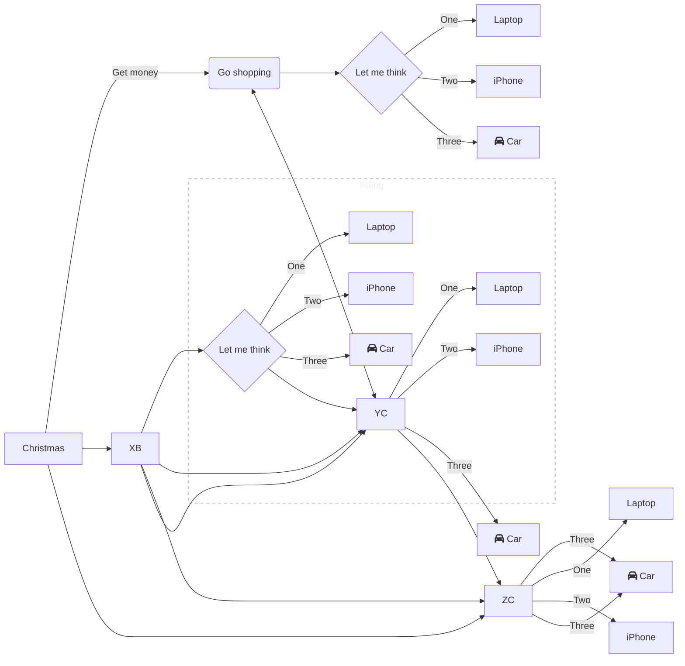
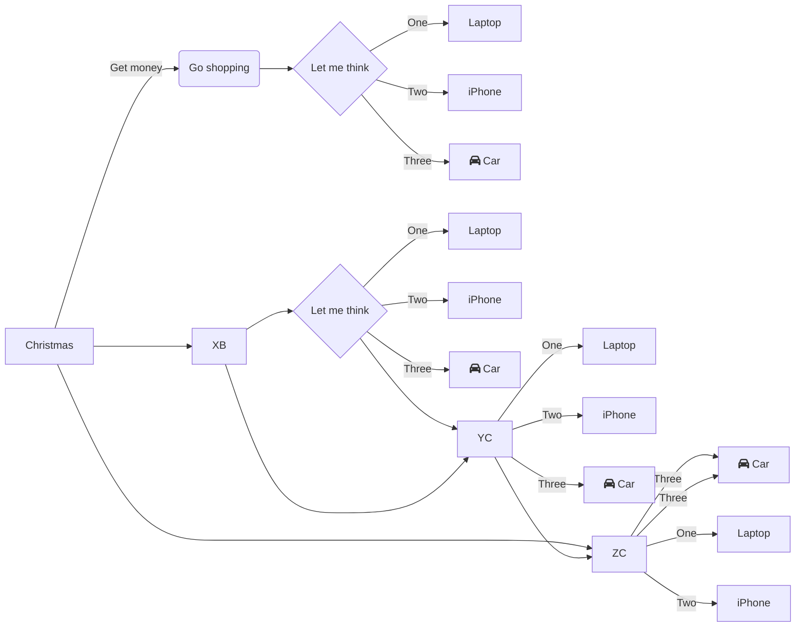

```mermaid
flowchart LR
    A[Christmas] -->|Get money| B(Go shopping)
    B --> C{Let me think}
    C -->|One| D[Laptop]
    C -->|Two| E[iPhone]
    C -->|Three| F[fa:fa-car Car]
    A --> XB
    XB --> XC{Let me think}
    subgraph listing
        XC -->|One| XD[Laptop]
        XC -->|Two| XE[iPhone]
        XC -->|Three| XF[fa:fa-car Car]
        YC -->|One| YD[Laptop]
        YC -->|Two| YE[iPhone]
    end
    YC -->|Three| YF[fa:fa-car Car]
    XC --> YC
    XB --> YC
    A --> ZC
    ZC -->|Three| ZF[fa:fa-car Car]
    ZC -->|One| ZD[Laptop]
    ZC -->|Two| ZE[iPhone]
    ZC -->|Three| ZF[fa:fa-car Car]
    YC --> ZC
    XB --> ZC
    XB --> YC
    B <--> YC
style listing color:#eee,stroke-dasharray: 5 5
style listing fill:none,stroke:#CCC,stroke-width:2px


```

```mermaid
flowchart LR
    A[Christmas] -->|Get money| B(Go shopping)
    B --> C{Let me think}
    C -->|One| D[Laptop]
    C -->|Two| E[iPhone]
    C -->|Three| F[fa:fa-car Car]
    A --> XB
    XB --> XC{Let me think}
    XC -->|One| XD[Laptop]
    XC -->|Two| XE[iPhone]
    XC -->|Three| XF[fa:fa-car Car]
    YC -->|One| YD[Laptop]
    YC -->|Two| YE[iPhone]
    YC -->|Three| YF[fa:fa-car Car]
    XC --> YC
    XB --> YC
    A --> ZC
    ZC -->|Three| ZF[fa:fa-car Car]
    ZC -->|One| ZD[Laptop]
    ZC -->|Two| ZE[iPhone]
    ZC -->|Three| ZF[fa:fa-car Car]
    YC --> ZC
```